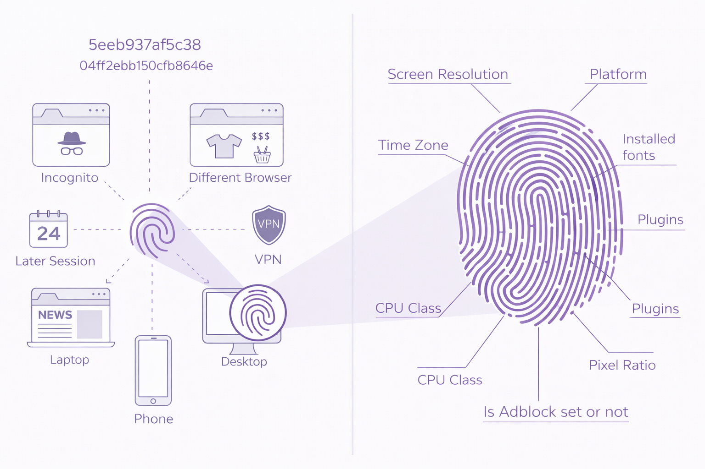

# Why do I Need 404?

## Who is this for?

Anyone who's tired of being tracked across the web despite "privacy tools" that don't work against modern fingerprinting.

!!! tip "404 has the capability to defeat modern fingerprinting techniques."

## Fighting consentless tracking

404 utilizes enterprise-tested solutions to *change* the fingerprint of any machine. 

Whether you're using a Macbook, PC, containerized application, or an ad-blocker should not matter to the websites you visit. With 404, that information never leaves your machine, and the servers collecting your data are fed a false fingerprint carefully crafted in-house.

## How big-tech tracks users

Every machine is unique. Companies combine dozens of semi-unique values to create a single device fingerprint. This allows ad-tech companies to follow you across websites, time, incognito browsers, and even VPN sessions.

## Browser Fingerprinting

Your online fingerprint is becoming increasingly unique. Modern tracking doesn't just rely on cookies; it builds "personality clouds" from hundreds of data points: TLS handshake patterns (JA3/JA4), HTTP header combinations, canvas rendering quirks, microphone/speaker/headset model and brand, font enumeration, WebGL parameters, audio context characteristics, and behavioral timing patterns... to name a few.

The collection of these semi-unique values (.nav properties, timezone, screen resolution, browser type, etc.) allows servers to confidently identify users. 

- [Google does this (and worse).](https://404privacy.com/blog/companies-are-ignoring-your-opt-out-and-google-is-enabling-them-potentially-5-8b-in-liability/)

- [LinkedIn does this.](https://404privacy.com/blog/linkedin-is-scanning-your-browser-extensions-this-is-how-they-use-the-data/)

Commercial fingerprinting services like FingerprintJS, Fingerprint.com, and DataDome can identify users across...

- Different browsers on the same device
- Private/incognito modes (linked to 'public' browsing profile)
- VPN connections (or proxies, even residential ones)
- Cookie & cache clearing 
- Different networks

[This is a response to GDPR, CCPA and increasingly privacy conscious users.](https://404privacy.com/blog/browser-fingerprinting-is-the-ad-industrys-response-to-your-privacy-settings/)

## The Bigger Picture

As governments worldwide push for mandatory surveillance (Chat Control in the EU, client-side scanning proposals, ["lawful access" backdoors](https://www.aclu.org/news/privacy-technology/dhs-is-circumventing-constitution-by-buying-data-it-would-normally-need-a-warrant-to-access)), and as AI makes behavioral profiling trivial at scale, the ability to be untrackable becomes existential.

404 demonstrates that privacy through illegibility isn't theoretical. It's implementable, it works, and it's available to anyone.

## Limitations

***Manual configuration*** - Profiles require review and occasional tweaking based on your use-case and threat model. If you're confused about configuration, feel free to reach out in an [email](mailto:support@404privacy.com), open a [GitHub issue](https://github.com/un-nf/404/issues){target="_blank"}, or [submit a ticket](https://discord.gg/X9QrVm6dqS){target="_blank"} in the Discord.

***!Occasional! breakage*** - Breakage is limited but expected. This is the nature of deep protocol mutation. If there's something critical, open a [GitHub issue](https://github.com/un-nf/404/issues){target="_blank"} and I will try to find a fix.

!!! Success "Tutanota mail + DDG already fixed due to user feedback"

***Active maintenance*** - Browser updates change fingerprinting surfaces. Profiles need updating. You can't just "set it and forget it." I update as frequently as I can.

!!! Warning "Long term effects"
    
    I do not know the long term effects on account usage. I have been logging-in via this proxy using my personal Google, Microsoft, and Apple accounts for the last 9-ish months, and I have experienced *no* retaliation (bans and whatnot). That is *not* to say you will have the same experience. **I *strongly* recommend that you use alternate/disposable accounts if you're going to be testing OAuth or other login flows.**