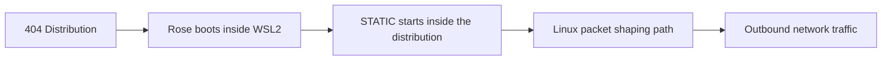
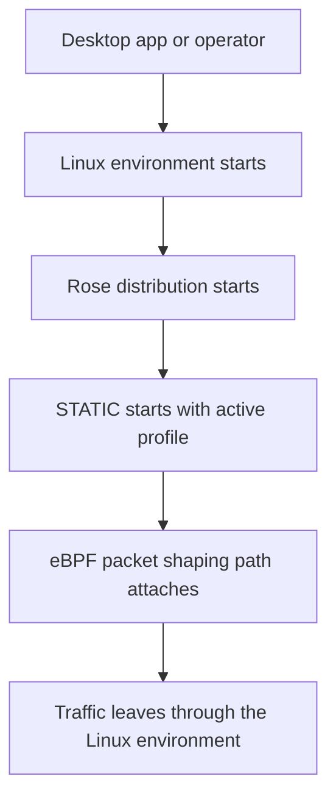

# What is Rose?

Rose is the Linux runtime distribution used by 404 on Windows through WSL2.

!!! tip "Rose is the Linux layer that starts STATIC and the eBPF path inside WSL2."

Rose provides a consistent runtime contract:

- `/opt/404/static`
- `/opt/404/ttl_editor.o`
- `/opt/404/404-init.sh`
- `/etc/wsl.conf` boot command wiring
- Windows-mounted runtime config at `AppData/Roaming/404/static/static.runtime.toml`

This keeps the Linux execution path:

- Fast
- Small
- Focused
- Predictable

It also allows packet-layer mutation and profile sync to run where Linux eBPF and TC are available.

## Components

- Linux rootfs imported into WSL2
- STATIC proxy binary
- eBPF classifier object
- Startup script that mounts `bpffs`, attaches TC filters, and launches STATIC
- Runtime config and profiles from Windows AppData

## How Rose works with STATIC

Rose does not replace STATIC.

STATIC still owns the active profile, the proxy flow, the injected JavaScript behavior, and the local control plane.

Rose provides the Linux environment and startup contract that STATIC runs within.

## Why this matters for normal users

Most people will never interact with Rose directly. That is fine. You are not supposed to.

What matters is what Rose makes possible:

- A small Linux environment for the distribution path
- A predictable boot path
- Lower-level network support that the normal desktop operating system path may not provide directly

## Where Rose runs

Rose runs as an imported WSL2 distribution on Windows.

!!! warning "Rose is not a general cross-platform layer"

    It belongs to the Linux distribution path and exists to support 404's networking features.

## What the Linux distribution path looks like

The important idea is that Rose is the runtime environment the distribution relies on.

## What Rose does not do

Rose does not:

- manage accounts or subscriptions
- operate as the main proxy
- inject browser JavaScript into pages
- replace STATIC
- act as the desktop app

Rose is one layer in a larger stack.

It is most useful when it works underneath STATIC, not instead of it.

## More than a packet mutator

Rose is the minimal Linux kernel foundation the 404 distribution uses.

The packet-shaping path is one important capability that runs on that foundation, but it is not the whole point of Rose.

The broader point is to provide a focused Linux environment that supports the 404 stack.

## Bottom line

Rose is the minimal Linux kernel compiled specifically for 404.

It gives 404 a small Linux foundation to boot on, supports the lower-level networking features the stack needs, and provides the base environment that STATIC uses on the distribution path.