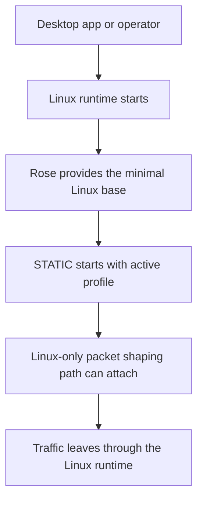

# What is Rose?

Rose is a minimal Linux kernel compiled specifically for the 404 runtime. It includes only the subsystems and modules the 404 stack requires.

!!! tip "Rose is the minimal Linux layer that the 404 distribution runs on."

## Why Rose exists

404 needs a Linux runtime on the distribution path, especially on Windows where the desktop app uses the managed Linux environment.

Rose exists so that environment stays:

- Fast
- Small
- Secure
- Focused
- Predictable
- Able to load the specific networking pieces 404 actually uses

It gives 404 a Linux path that can support lower-level networking features such as the packet shaping layer used alongside STATIC.

## What Rose is actually made of

Rose is not a separate public cloud service. It is part of the local runtime stack.

At a high level, Rose is the base Linux layer that the 404 distribution uses. That distribution then carries the rest of the runtime pieces on top of it, including:

- The boot environment
- The STATIC runtime binary
- The lower-level packet mutation tooling used on the Linux path
- The startup logic that brings those pieces together

In plain terms, Rose is the Linux kernel foundation that makes the 404 distribution possible.

## What Rose enables

Support for:

- Booting the 404 runtime cleanly
- Starting STATIC from the expected runtime contract
- Supporting the packet-layer mutation path on Linux
- Keeping the distribution small and focused

## How Rose works with STATIC

Rose does not replace STATIC.

STATIC still owns the active profile, the proxy flow, the injected JavaScript behavior, and the local control plane.

Rose provides the Linux layer that STATIC runs on when 404 uses the distribution path.

## Why this matters for normal users

Most people will never interact with Rose directly. That is fine. You are not supposed to.

What matters is what Rose makes possible:

- A small Linux runtime for the distribution path
- A predictable boot path
- Lower-level network support that the normal desktop operating system path may not provide directly

## Where Rose runs

Rose runs inside the Linux distribution path used by 404.

!!! warning "Rose is not a general cross-platform layer"

    It belongs to the Linux distribution path and exists to support 404's lower-level features.

## What the Linux runtime path looks like

The important idea is that Rose is the environment the distribution relies on. It is the base that allows the rest of the Linux runtime stack to start cleanly and stay focused.

## What Rose does not do

Rose does not:

- manage accounts or subscriptions
- operate as the main proxy
- inject browser runtime code into pages
- replace STATIC
- act as the desktop app

Rose is one layer in a larger stack.

It is most useful when it works underneath STATIC, not instead of it.

## Why Rose and STATIC are separate

It may seem simpler to put everything into one runtime, but these layers solve different problems.

STATIC is best at:

- proxy behavior
- runtime profile state
- JavaScript and document-layer shaping
- local control-plane supervision

Rose is best at:

- providing the minimal Linux base for the distribution path
- loading only the system pieces that 404 actually needs
- supporting Linux-side networking features used by the stack

Separating those responsibilities makes the system easier to reason about.

It also means the desktop app can supervise a clear runtime contract instead of mixing application logic and Linux packet logic together.

!!! tip "If you want the technical references"

    For the Linux runtime packaging view, see [runtime/distro.md](../runtime/distro.md)

    For the eBPF and packet-layer details, see [resources/ebpf.md](../resources/ebpf.md)

## The biggest misunderstanding about Rose

The biggest misunderstanding is thinking that Rose is just a packet mutator.

That is too narrow.

Rose is the minimal Linux kernel foundation the 404 distribution uses.

The packet-shaping path is one important capability that runs on that foundation, but it is not the whole point of Rose.

The broader point is to provide a small, focused Linux environment that supports the 404 runtime stack without carrying unnecessary system surface.

## Bottom line

Rose is the minimal Linux kernel compiled specifically for the 404 runtime.

It gives 404 a small Linux foundation to boot on, supports the lower-level networking features the stack needs, and provides the base environment that STATIC uses on the distribution path.