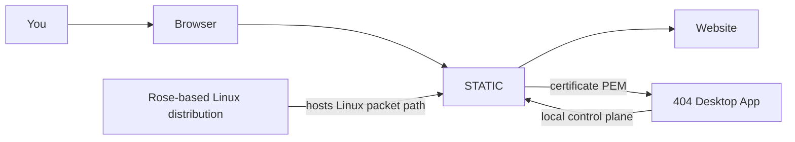
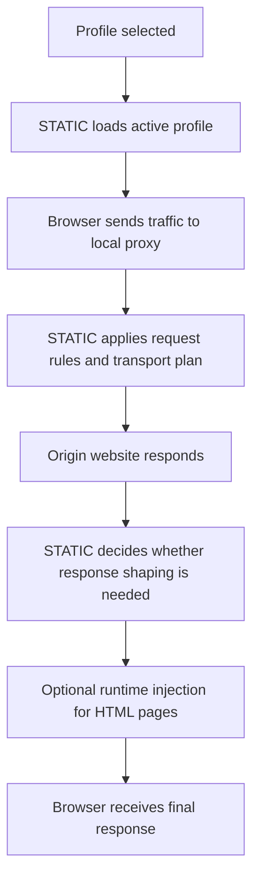

# What is STATIC

STATIC is the runtime engine inside 404.

??? tip "STATIC sits between your browser and the websites you visit, reshaping your fingerprint across TLS, HTTP header, and JavaScript surfaces to match the profile you choose."

    It receives your browser traffic, applies the selected browser profile, manages the local certificate authority used for inspection, and exposes a small local control API.

## Why

Modern websites compare many layers at once:

- HTTP headers
- TLS handshake behavior
- browser JavaScript surfaces
- iframe and worker behavior
- cache and content-security-policy behavior

If those layers disagree with each other, a user can be flagged as suspicious (a bot), which can lead to elevated behavior from the website (i.e. CAPTCHAs, blocked requests).

STATIC reduces those contradictions by turning one profile into a coordinated set of behaviors instead.

## What does STATIC do?

### 1. Runs the local proxy

Your browser points to 404 as a local proxy. STATIC receives the traffic and becomes the local runtime that handles the session.

That allows it to inspect, route, and reshape traffic before it leaves the machine.

### 2. Selects and applies a profile

STATIC loads a profile catalog and keeps one active profile in memory.

That profile describes the browser identity that 404 presents:

- Browser family and variant
- Header behavior
- JavaScript runtime behavior
- Transport preferences
- Packet-profile values that the Linux packet path can apply when STATIC is running on the Rose-based distribution

### 3. Spoofs your fingerprint

When STATIC connects to a website, it does not behave like a plain proxy.

It plans the outgoing transport using the selected profile. That includes the parts of TLS and HTTP behavior that the proxy controls.

### 4. Injects the JavaScript spoofing layer

When a page needs it, STATIC injects the local script bundle that shapes higher-level browser surfaces inside the page.

This is how 404 coordinates things like:

- navigator-facing identity
- worker behavior
- iframe propagation
- selected spoofing surfaces such as canvas and audio

### 5. Manages the local CA

STATIC creates the certificate authority material used for TLS-termination.

!!! tip "The host application can request the public certificate, but the private key stays with the runtime."

### 6. Exposes a local control plane

STATIC provides a small local API for:

- Readiness checks
- Stop requests
- CA status and initialization
- Telemetry snapshots
- Profile catalog access
- Active-profile reads
- Profile selection
- Profile validation

That is how the desktop application supervises STATIC without becoming the runtime itself.

## How STATIC fits into 404

The key point is that STATIC is the center of the runtime stack.

- The browser talks through STATIC.
- The desktop app supervises STATIC.
- On the Linux distribution path, STATIC runs on the Rose base so the lower-level Linux networking path can stay aligned with the same selected identity.

## Browsing flow

## What STATIC does not do

STATIC is one part of the 404 ecosystem.

It does not:

- Install or remove system trust
- Update automatically
- Enforce browser family parity
- Rewrite low-level packet fingerprints
- Guarantee exact perfect impersonation for every browser and website combination

!!! warning "Some lower-level network behavior is handled by the Linux runtime path that STATIC runs on rather than by STATIC alone."

## Desktop Application

The desktop app handles the user-facing parts of 404:

- Installation
- Updates
- Profile orchestration
- Host trust installation
- Host proxy configuration
- Operating-system cleanup

This keeps the privacy engine local and focused, while the app handles the operating-system integration.

## Not "just a proxy"

A normal proxy routes your traffic through external servers to mask your IP or device fingerprint. 404 hosts no infrastructure and thus *cannot* change your IP address.

Rather, STATIC runs locally to spoof multiple parts of your fingerprint to match the selected profile:

- Request behavior
- Response shaping
- JavaScript surfaces
- Active-profile state
- Transport planning
- CA lifecycle
- Local supervisory control

!!! Abstract "Technical reference"

    The deeper technical page for STATIC is available here: [resources/static.md](../resources/static.md)

## Where STATIC runs

STATIC always runs locally.

Depending on platform and product mode, that means:

- Directly as a local sidecar process
- Inside the Linux runtime used by the Windows desktop path
- In a self-hosted environment when you run the open source stack yourself