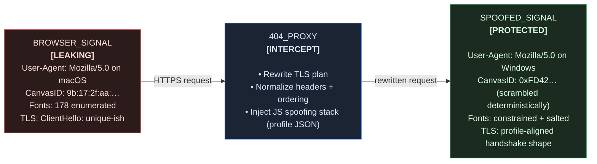
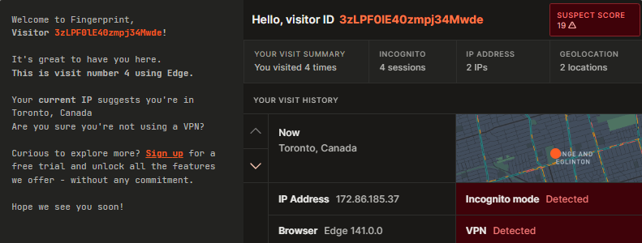

---
hide:
  - toc
---


# What is 404?

By leveraging a Blazing fast Rust privacy proxy & a Linux kernel module, 404 offers full control over your machine's fingerprint.


## The “personality cloud” (before / after)



404 houses two main modules:
- STATIC Proxy - *Synthetic Traffic and TLS Identity Camouflage*
- Linux eBPF module

### STATIC Proxy
#### *Synthetic Traffic and TLS Identity Camouflage*

The heart of 404, built in Rust. 

> Native values from FingerprintJS .

> Spoofed values from FingerprintJS .

The STATIC proxy is wired specifically to give the user granular control over their online fingerprint. Not just their browser fingerprint, but any device or app they choose to route through the proxy.

As it stands in v1.0, STATIC runs on `localhost:4040` by default, never exposing itself to the internet or any device other than the one that it is running on. The logic behind STATIC is pretty simple and mimics a lot of the high-level logic that [`mitmproxy`](https://www.mitmproxy.org/){target="_blank"} employs. 

Requests are broken into `flows`. Each `flow` passes through multiple `stages`. A `stage` is where the request/response mutation happens.

**Request stages:**

1. **HeaderProfileStage** - Rewrites headers based on your selected profile (User-Agent, Accept, sec-ch-ua, Accept-Language). Maintains strict ordering to match real browser behavior: remove -> replace -> replaceArbitrary -> replaceDynamic -> set -> append.

2. **AltSvcStage** - Downgrades or strips HTTP/3 advertisements to prevent protocol leakage.

3. **CspStage** - Generates CSP nonces and rewrites Content-Security-Policy headers so injected scripts execute without breaking origin policies.

4. **JsInjectionStage** - Embeds the fingerprint spoofing stack (bootstrap, globals shim, config layer, spoof scripts) at the beginning of `<head>`. Records SHA-256 hashes for CSP validation.

5. **BehavioralNoiseStage** - Tags the flow with timing patterns for coordination between Rust and injected JavaScript.

**Response stages:**

1. **CspStage** - Finalizes CSP headers with script hashes and nonces, handles strict-dynamic policies, preserves origin inline scripts.

2. **JsInjectionStage** - Performs the actual HTML mutation, decompresses responses if needed (gzip/deflate/brotli), injects scripts at the earliest safe insertion point.

3. **AltSvcStage** - Strips or normalizes Alt-Svc headers in responses to prevent the browser from upgrading to HTTP/3.

Each stage runs asynchronously and can inspect or mutate the request/response. The pipeline is deterministic. Same profile, same mutations, same fingerprint.

> Don't believe me? Check my work... 
>
- [FingerprintJS](https://demo.fingerprint.com/playground){target="_blank"}
- [Browser Leaks](https://browserleaks.com/){target="_blank"}
- [EFF - Cover Your Tracks](https://coveryourtracks.eff.org/){target="_blank"}
- [What is my Browser](https://whatismybrowser.com/){target="_blank"}
- [HTTP bin](https://httpbin.org/headers){target="_blank"}

### Linux eBPF module

The eBPF module is, again, quite simple. It leverages powerful, fast, well documented, low-level Linux kernel hooks. By attaching carefully crafted eBPF programs to Linux's Traffic Control (tc) egress hooks, we can mutate files extensively.

Currently, the following is implemented:
```md
**IPv4:**
- TTL (Time To Live) -> forced to 255
- TOS (Type of Service) -> set to 0x10
- IP ID (Identification) -> randomized per packet
- TCP window size -> 65535
- TCP initial sequence number -> randomized (again)
- TCP window scale -> 5
- TCP MSS (Maximum Segment Size) -> 1460
- TCP timestamps -> randomized

**IPv6:**
- Hop limit -> forced to 255
- Flow label -> randomized
```

---