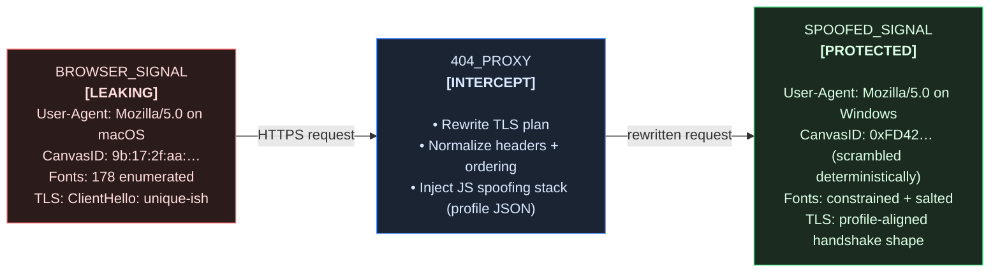

# What is 404?

404 is a local traffic-shaping system built around two core components:

- STATIC, a Rust TLS-terminating proxy
- a Linux eBPF component for packet-level mutation

## Your “Personality Cloud”

```mermaid
flowchart LR
  %% Zig-zag layout: left → middle → right
  A["BROWSER_SIGNAL<br/><b>[LEAKING]</b><br/>User-Agent: Mozilla/5.0 on macOS<br/>CanvasID: 9b:17:2f:aa:…<br/>Fonts: 178 enumerated<br/>TLS: ClientHello: unique-ish"]

  B["404_PROXY<br/><b>[INTERCEPT]</b><br/><br/>• Rewrite TLS plan<br/>• Normalize headers + ordering<br/>• Inject JS spoofing stack (profile JSON)"]

  C["SPOOFED_SIGNAL<br/><b>[PROTECTED]</b><br/><br/>User-Agent: Mozilla/5.0 on Windows<br/>CanvasID: 0xFD42… (scrambled deterministically)<br/>Fonts: constrained + salted<br/>TLS: profile-aligned handshake shape"]

  A -->|HTTPS request| B -->|rewritten request| C

  classDef leak fill:#2b1b1b,stroke:#ff6b6b,stroke-width:1px,color:#ffdede;
  classDef mid  fill:#1b2433,stroke:#4b8bff,stroke-width:1px,color:#dbe9ff;
  classDef safe fill:#1b2b1f,stroke:#4ade80,stroke-width:1px,color:#dcffe7;

  class A leak;
  class B mid;
  class C safe;

```

404 houses two main modules:

- STATIC Proxy, *Synthetic Traffic and TLS Identity Camouflage*
- Linux eBPF module

## STATIC Proxy
### *Synthetic Traffic and TLS Identity Camouflage*

STATIC is a local Rust proxy that terminates browser traffic, applies profile-driven mutations, and forwards the rewritten request.

STATIC listens on `127.0.0.1:4040` running locally on your machine. 404 does not route traffic because we do not host any server infrastructure.

Requests and responses move through a fixed stage pipeline.

1. **HeaderProfileStage** loads the selected profile and rewrites request headers and related request metadata.
2. **BehavioralNoiseStage** attaches timing and behavior hints used by the injected JavaScript spoofing script.
3. **CspStage** rewrites Content Security Policy (CSP) to prevalidate script injection.
4. **JsInjectionStage** injects the spoofing script into eligible HTML responses and records CSP hash material.
5. **AltSvcStage** normalizes or removes `Alt-Svc` headers to reduce HTTP/3 and QUIC identity drift.

??? tip "Don't believe me? Check my work..."

  Start 404 and compare native output against proxied output with the following tools.

    - [FingerprintJS](https://demo.fingerprint.com/playground){target="_blank"}
    - [Browser Leaks](https://browserleaks.com/){target="_blank"}
    - [EFF - Cover Your Tracks](https://coveryourtracks.eff.org/){target="_blank"}
    - [What is my Browser](https://whatismybrowser.com/){target="_blank"}
    - [HTTP bin](https://httpbin.org/headers){target="_blank"}

## Linux eBPF module

The eBPF module runs on Linux `tc` egress hooks and modifies your TCP/IP fingerprint which can identify hardware, OS, browser stack, and network environment.

Current defaults:

**IPv4**

- TTL forced to `255` - For testing
- TOS set to `0x10` 
- IP ID randomized per packet
- TCP window size set to `65535`
- TCP initial sequence number randomized
- TCP window scale set to `5`
- TCP MSS set to `1460`
- TCP timestamps randomized

**IPv6**

- Hop limit forced to `255`
- Flow label randomized