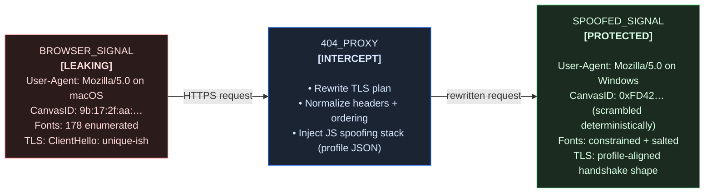
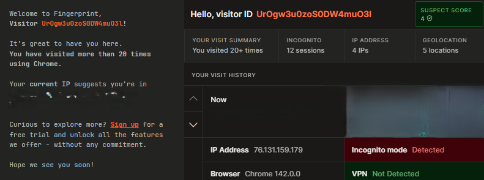
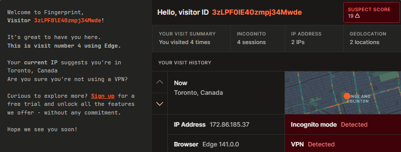

# What is 404?

404 is a local traffic-shaping system built around two core components:

- STATIC, a Rust TLS-terminating proxy
- a Linux eBPF component for packet-level mutation


## Your “Personality Cloud”


```mermaid
flowchart LR
  %% Zig-zag layout: left -> middle -> right
  A["BROWSER_SIGNAL<br/><b>[LEAKING]</b><br/>User-Agent: Mozilla/5.0 on macOS<br/>CanvasID: 9b:17:2f:aa:…<br/>Fonts: 178 enumerated<br/>TLS: ClientHello: unique-ish"]

  B["404_PROXY<br/><b>[INTERCEPT]</b><br/><br/>• Rewrite TLS plan<br/>• Normalize headers + ordering<br/>• Inject JS spoofing stack (profile JSON)"]

  C["SPOOFED_SIGNAL<br/><b>[PROTECTED]</b><br/><br/>User-Agent: Mozilla/5.0 on Windows<br/>CanvasID: 0xFD42… (scrambled deterministically)<br/>Fonts: constrained + salted<br/>TLS: profile-aligned handshake shape"]

  A -->|HTTPS request| B -->|rewritten request| C

  classDef leak fill:#2b1b1b,stroke:#ff6b6b,stroke-width:1px,color:#ffdede;
  classDef mid  fill:#1b2433,stroke:#4b8bff,stroke-width:1px,color:#dbe9ff;
  classDef safe fill:#1b2b1f,stroke:#4ade80,stroke-width:1px,color:#dcffe7;

  class A leak;
  class B mid;
  class C safe;

```

404 houses two main modules:

- STATIC Proxy, *Synthetic Traffic and TLS Identity Camouflage*
- Linux eBPF module

## STATIC Proxy
### *Synthetic Traffic and TLS Identity Camouflage*

The core of 404 is a Rust proxy.

> Native values from FingerprintJS .

> Spoofed values from FingerprintJS .

The STATIC proxy is designed to give the operator granular control over online fingerprint surfaces. That includes browser traffic, but it can also apply to other traffic routed through the proxy.

With the sample config, STATIC listens on `127.0.0.1:4040` by default. If you run the standalone binary without a config file, it falls back to built-in CLI defaults and listens on `127.0.0.1:8443`.

The proxy stays local. It is not a hosted browser relay or a remote proxy service.

Requests are broken into `flows`. Each `flow` passes through multiple `stages`. A `stage` is where the request/response mutation happens.

The current stage order is deterministic:

1. **HeaderProfileStage** rewrites headers based on the selected profile.
2. **BehavioralNoiseStage** tags the flow with timing patterns for coordination with the injected runtime.
3. **CspStage** prepares CSP state so injected scripts can execute without breaking origin policies.
4. **JsInjectionStage** embeds the spoofing runtime into HTML responses and records script hashes for CSP validation.
5. **AltSvcStage** strips or normalizes Alt-Svc handling to reduce accidental HTTP/3 and QUIC identity drift.

Each stage runs asynchronously and can inspect or mutate the request/response. The pipeline is deterministic. Same profile, same mutations, same fingerprint.

> Don't believe me? Check my work... 
>
- [FingerprintJS](https://demo.fingerprint.com/playground){target="_blank"}
- [Browser Leaks](https://browserleaks.com/){target="_blank"}
- [EFF - Cover Your Tracks](https://coveryourtracks.eff.org/){target="_blank"}
- [What is my Browser](https://whatismybrowser.com/){target="_blank"}
- [HTTP bin](https://httpbin.org/headers){target="_blank"}

## Linux eBPF module

The eBPF module uses Linux Traffic Control (`tc`) egress hooks to mutate packets before they leave the machine.

Currently, the following is implemented:
```md
**IPv4:**
- TTL (Time To Live) -> forced to 255
- TOS (Type of Service) -> set to 0x10
- IP ID (Identification) -> randomized per packet
- TCP window size -> 65535
- TCP initial sequence number -> randomized (again)
- TCP window scale -> 5
- TCP MSS (Maximum Segment Size) -> 1460
- TCP timestamps -> randomized

**IPv6:**
- Hop limit -> forced to 255
- Flow label -> randomized
```
