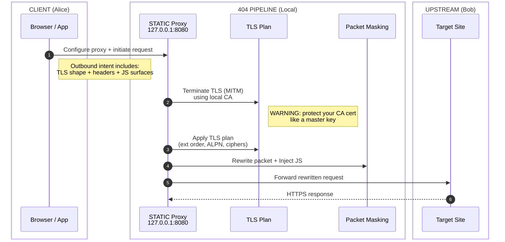

```mermaid
sequenceDiagram
    autonumber

    %% --- Three columns (Tor-style) ---
    box CLIENT (Alice)
        participant C as Browser / App
    end

    box 404 PIPELINE (Local)
        participant P as STATIC Proxy<br/>127.0.0.1:8080
        participant TLS as TLS Plan
        participant H as Packet Masking
    end

    box UPSTREAM (Bob)
        participant S as Target Site
    end

    %% --- Request path ---
    C->>P: Configure proxy + initiate request
    note right of C: Outbound intent includes:<br/>TLS shape + headers + JS surfaces

    P->>TLS: Terminate TLS (MITM)<br/>using local CA
    note right of TLS: WARNING: protect your CA cert<br/>like a master key

    P->>TLS: Apply TLS plan<br/>(ext order, ALPN, ciphers)
    P->>H: Rewrite packet + Inject JS

    P->>S: Forward rewritten request

    %% --- Response path ---
    S-->>P: HTTPS response

```