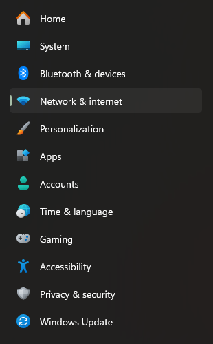
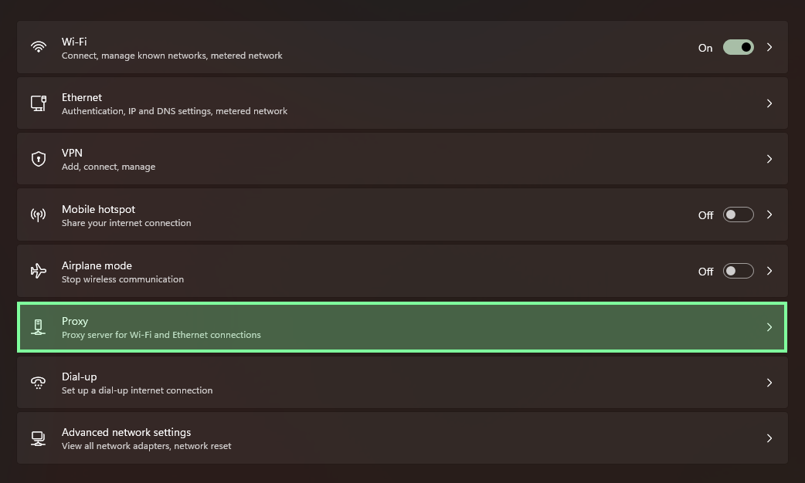
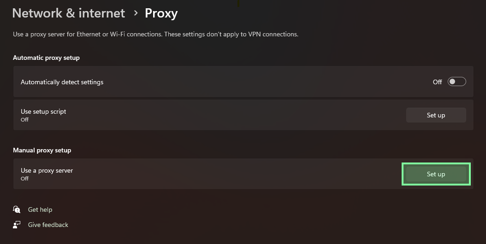
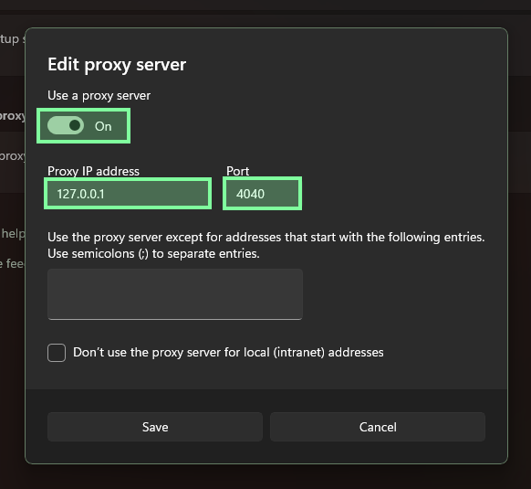

# Windows

This is the Windows self-hosted path.

It uses the 404 distribution, which is built on the Rose base and booted with WSL2. This page does not document running the raw Windows STATIC binary as the normal Windows operator path.

[Download for Windows x64](https://github.com/un-nf/404/releases/latest/download/404-windows-x64.zip){ .md-button .md-button--primary }

The Windows operator bundle includes:

- `404-distro.tar.gz`
- `404-distro-manifest.json`
- `404-distro-manifest.json.sig`
- `AppData\Roaming\404\static\static.runtime.toml`
- `AppData\Roaming\404\static\profiles\manifest.json`
- `AppData\Roaming\404\static\profiles\firefox-windows.json`
- `AppData\Roaming\404\static\profiles\chrome-windows.json`
- `AppData\Roaming\404\static\profiles\edge-windows.json`
- `AppData\Local\404\wsl\control-token`

Extract `404-windows-x64.zip` directly into your Windows home folder, which is usually `C:\Users\<your-username>`.

That extraction step should place:

- `404-distro.tar.gz`, `404-distro-manifest.json`, and `404-distro-manifest.json.sig` in your home folder
- the full `AppData\Roaming\404\static` tree in the right place
- the `AppData\Local\404\wsl\control-token` file in the right place

---

## Before you start

- WSL2 must be available on the machine because it is the Windows host mechanism used to boot the 404 distribution
- the public profile catalog is `chrome-windows`, `edge-windows`, and `firefox-windows`
- the bundled `static.runtime.toml` config defaults to `firefox-windows`
- if you use Chrome, swap `firefox-windows` for `chrome-windows`
- if you use Edge, swap `firefox-windows` for `edge-windows`
- STATIC listens on `127.0.0.1:4040` on the Windows side once the distribution is running
- the local control plane uses port `4042`

For the exact tagged release page, use [{{ latest_github_release_tag }}]({{ latest_github_release_url }}).

---

## 1. Verify the download matches the manifest

Run this in PowerShell:

```powershell
$manifest = Get-Content "$HOME\Downloads\404-windows-x64\404-distro-manifest.json" | ConvertFrom-Json
$archiveHash = (Get-FileHash "$HOME\Downloads\404-windows-x64\404-distro.tar.gz" -Algorithm SHA256).Hash.ToLower()

"manifest version: $($manifest.version)"
"manifest artifact path: $($manifest.artifact_path)"
"manifest sha256: $($manifest.sha256)"
"archive sha256:  $archiveHash"
```

The two SHA-256 values should match.

---

## 2. Extract the bundle into your Windows home folder

Right-click `404-windows-x64.zip`, choose `Extract All...`, and set the destination to your Windows home folder.

In the Extract All dialog:

1. click `Browse...`
2. open `This PC → Local Disk (C:) → Users → <your-username>`
3. click `Select Folder`
4. click `Extract`

??? abstract "Powershell command"

    ```powershell
    Expand-Archive -LiteralPath "$HOME\Downloads\404-windows-x64.zip" -DestinationPath "$HOME" -Force
    ```

---

## 3. Change the default profile

!!! info "The default profile is Firefox-Windows"
        
    If you are using a Blink based profile, you'll have to use the `Chrome-Windows` or `Edge-Windows` profile.

- File: `%APPDATA%\404\static\static.runtime.toml`

Line to change:

```toml
default_profile = "firefox-windows"
```

??? abstract "I want to use the Chrome profile"

	Run this in PowerShell:

    ```powershell
    (Get-Content "$env:APPDATA\404\static\static.runtime.toml") -replace 'default_profile = "firefox-windows"', 'default_profile = "chrome-windows"' | Set-Content "$env:APPDATA\404\static\static.runtime.toml"
    ```

??? abstract "I want to use the Edge profile"

	Run this in PowerShell:

    ```powershell
    (Get-Content "$env:APPDATA\404\static\static.runtime.toml") -replace 'default_profile = "firefox-windows"', 'default_profile = "edge-windows"' | Set-Content "$env:APPDATA\404\static\static.runtime.toml"
    ```

This default configuration is as follows:

- Listener on `4040`
- Control plane on `4042`
- File-backed key storage
- Profiles loaded from the local `profiles` directory beside the config file
- control token loaded from the relative Windows local-app-data path

---

## 4. Import the distribution and write the Windows username file

Run these two commands in PowerShell:

```powershell
$DistroName = "404"
wsl --import $DistroName "$env:LOCALAPPDATA\404\wsl\$DistroName" "$HOME\404-distro.tar.gz" --version 2
wsl -d $DistroName -- sh -lc "printf '%s\n' '$env:USERNAME' > /opt/404/win-user"
```

The import directory intentionally lives under `%LOCALAPPDATA%\404\wsl\$DistroName`. That is the Windows-side storage location for the imported self-hosted distro.

For self-hosted Windows development, you can use a different distro name such as `404-dev` to keep it isolated from the app-managed runtime.

---

## 5. Start the distribution and confirm start

Launch the distro:

```powershell
wsl -d $DistroName
```

The fixed WSL distro name `404` is only required for the desktop app-managed runtime. The self-hosted path documented here can run under `404`, `404-dev`, or another name as long as you use that same name consistently in the commands above.

After the distribution boots, `404-init.sh` reads `static.runtime.toml`, mounts `bpffs`, pre-loads `ttl_editor.o` with `bpftool` when available, attaches the pinned classifier to live `eth*` interfaces, pins `fingerprint_profiles`, and starts STATIC in proxy mode. If `bpftool` is unavailable, it falls back to direct `tc` object loading.

The bundled distro is Alpine-based. Use `sh`, not `bash`, for commands you run inside `404` unless you installed `bash` yourself.

??? abstract "I need to attach `ttl_editor.o` to a different interface"

    First, list the interfaces inside the distro:

    ```powershell
    wsl -d $DistroName -- ip link show
    ```

    Then either set `EGRESS_IFACES` for that session or attach manually.

    Session override:

    ```powershell
    wsl -d $DistroName -- sh -lc 'EGRESS_IFACES=<interface> /opt/404/404-init.sh'
    ```

    Manual attach:

    ```powershell
    wsl -d $DistroName -- sh -lc 'mkdir -p /sys/fs/bpf/404/ttl_programs; bpftool prog loadall /opt/404/ttl_editor.o /sys/fs/bpf/404/ttl_programs; tc qdisc add dev <interface> clsact 2>/dev/null || true; tc filter add dev <interface> egress bpf da pinned /sys/fs/bpf/404/ttl_programs/tc_counter'
    ```

Open a second PowerShell window to confirm 404 has started. This reads the control token from the Windows-side `%LOCALAPPDATA%\404\wsl\control-token` path configured by the bundled runtime config:

```powershell
$TokenPath = "$env:LOCALAPPDATA\404\wsl\control-token"
$token = Get-Content $TokenPath -Raw
Invoke-RestMethod -Headers @{ "X-404-Control-Token" = $token } http://127.0.0.1:4042/status
```

??? abstract "The distro booted, but I need to start eBPF or STATIC manually"

        If the distro imports successfully but you end up at a shell prompt instead of a fully running proxy, use the following order.

        > From Windows PS terminal (not wsl)

        1. Confirm the runtime config exists:

        ```powershell
        wsl -d $DistroName -- sh -lc 'WIN_USER=$(cat /opt/404/win-user); ls -l \
            "/mnt/c/Users/${WIN_USER}/AppData/Roaming/com.404.app/static/static.runtime.toml" \
            "/mnt/c/Users/${WIN_USER}/AppData/Roaming/404/static/static.runtime.toml" 2>/dev/null'
        ```

        2. If you need to attach the eBPF classifier manually, use the Alpine-safe pinned-program flow:

        ```powershell
        wsl -d $DistroName -- sh -lc 'mkdir -p /sys/fs/bpf/404/ttl_programs; bpftool prog loadall /opt/404/ttl_editor.o /sys/fs/bpf/404/ttl_programs; tc qdisc add dev <interface> clsact 2>/dev/null || true; tc filter add dev <interface> egress bpf da pinned /sys/fs/bpf/404/ttl_programs/tc_counter'
        ```

        3. If you want the normal boot contract after that, run:

        ```powershell
        wsl -d $DistroName -- sh -lc '/opt/404/404-init.sh'
        ```

        4. If eBPF is already attached and you only need to bring up STATIC manually, run the binary directly:

        ```powershell
        wsl -d $DistroName -- sh -lc 'WIN_USER=$(cat /opt/404/win-user); CONFIG=""; for candidate in \
            "/mnt/c/Users/${WIN_USER}/AppData/Roaming/com.404.app/static/static.runtime.toml" \
            "/mnt/c/Users/${WIN_USER}/AppData/Roaming/404/static/static.runtime.toml"; do \
            if [ -f "$candidate" ]; then CONFIG="$candidate"; break; fi; done; \
            /opt/404/static --config "$CONFIG" --mode proxy'
        ```

        5. If you copied scripts into the distro from Windows and they fail with `$'\r'` or `invalid option`, normalize line endings before running them:

        ```powershell
        wsl -d $DistroName -- sh -lc "sed -i 's/\r$//' /opt/404/404-init.sh; chmod +x /opt/404/404-init.sh"
        ```

Useful verification helpers from the open-source repo:

- `scripts/inspect-ebpf-state.sh` prints the routed egress path, attached `eth*` interfaces, pinned packet profile map, decoded profile entry, and protocol counters.
- `scripts/tcpdump-syn-fingerprint.sh` captures outbound SYN packets and prints TTL, window, MSS, window scale, and option ordering on the live routed interface.

Those helper scripts are repo-side developer tools written for `bash`. They are not part of the packaged Alpine distro boot path. Run them from a repo checkout in your WSL development environment, or install `bash` in the distro first if you intentionally want to run them there.

---

## 6. Trust the generated CA

On the self-hosted WSL path, STATIC stores its generated CA under the runtime user's Linux app-data directory, not under `/opt/404` and not under the desktop app-managed Windows cert path.

For the default self-hosted distro flow, where STATIC runs as `root`, the live files are typically:

- `\\wsl.localhost\<distro-name>\root\.local\share\static_proxy\certs\static-ca.crt`
- `\\wsl.localhost\<distro-name>\root\.local\share\static_proxy\certs\static-ca.key.dpapi`

Example for `404-dev`:

```powershell
$LiveCaDir = "\\wsl.localhost\$DistroName\root\.local\share\static_proxy\certs"
Get-ChildItem $LiveCaDir
```

For the self-hosted path, the simplest trust path is to use the live cert directly from the distro:

```powershell
$LiveCaPath = "\\wsl.localhost\$DistroName\root\.local\share\static_proxy\certs\static-ca.crt"
certutil.exe -addstore root $LiveCaPath
```

??? abstract "I want a Windows-local exported copy of the CA"

    Fetch the generated CA from the local control plane and export a Windows-local copy for trust installation:

    ```powershell
    $TokenPath = "$env:LOCALAPPDATA\404\wsl\control-token"
    $token = Get-Content $TokenPath -Raw
    $ca = Invoke-RestMethod -Headers @{ "X-404-Control-Token" = $token } http://127.0.0.1:4042/ca/status
    $ca.cert_pem | Set-Content "$env:LOCALAPPDATA\404\wsl\static-ca.crt"
    ```

Manual install:

1. :material-microsoft-windows:{ .lg .middle } + `R`
2. Paste the live self-hosted cert path for your distro, for example `\\wsl.localhost\404\root\.local\share\static_proxy\certs\static-ca.crt`
3. Click `Open`
4. Click `Install Certificate...`.
5. Select `Current User` and click `Next`.
6. Choose `Place all certificates in the following store` and click `Browse...`.
7. Select `Trusted Root Certification Authorities` and click `OK`.
8. Click `Next` and then `Finish`.

If you use Firefox, you must import the certificate into Firefox:

- Settings → Privacy & Security → Certificates → View Certificates
- Authorities → Import
- select the live self-hosted cert at `\\wsl.localhost\<distro-name>\root\.local\share\static_proxy\certs\static-ca.crt`, or `%LOCALAPPDATA%\404\wsl\static-ca.crt` only if you explicitly exported a Windows-local copy
- enable `Trust this CA to identify websites`

---

## 7. Route browser traffic through the listener

The STATIC listener is located at `127.0.0.1:4040`.

For Chrome or Edge:

- Windows Settings → Network & internet → Proxy
- Enable Manual proxy setup
- Address: `127.0.0.1`
- Port: `4040`

Click `Network & internet` from the main Windows Settings page:



Then open `Proxy` from the network settings page:



On the proxy page, select the manual proxy section:



Turn `Use a proxy server` on and enter `127.0.0.1` with port `4040`:



For Firefox:

- Settings → Network Settings → Manual proxy configuration
- HTTP Proxy: `127.0.0.1`
- Port: `4040`
- Check `Also use this proxy for HTTPS`

At that point, browser traffic routed through the configured proxy listener will flow through the 404 distribution and into STATIC.