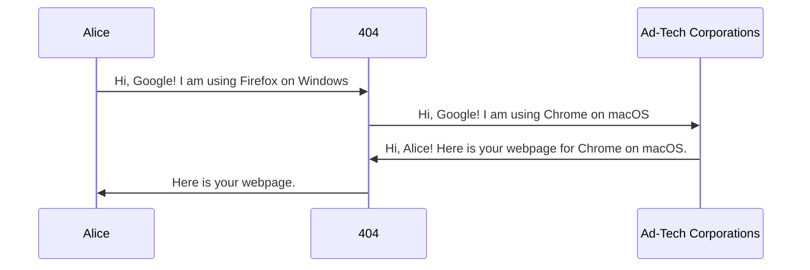

# 404 - Home

## Reclaim Your **Digital Anonymity**

*Local by design. Illegibility on purpose.*

!!! info "v1.1 available"
    New builds are live. If you’re upgrading, skim the release notes before swapping profiles.

[Get Started](Overview/consent.md){.md-button .md-button--primary}
[GitHub](https://github.com/un-nf/404){.md-button}

---

## Core capabilities

-   ### Anti-fingerprinting
    404 targets *correlation*: offers coherent profiles across **TLS → headers → JS surfaces**.

-   ### Cross-platform
    Written in Rust for **Windows, macOS, Linux**. Run locally, keep control locally.

-   ### Open source
    Full transparency.

---

## The leakage problem

Your browser is telling ad-tech corporations **too much**.

Websites and fingerprinting vendors collect semi-unique signals and combine them into a “personality cloud”:

- Canvas and text rendering quirks  
- WebGL parameters and GPU hints  
- Audio context characteristics  
- Fonts and device enumeration  
- Locale/timezone/screen geometry  
- TLS and header shapes
- Typing speed

404 sits in the middle and **rewrites your fingerprint** before it leaves your machine.

---

## What 404 changes

#### **TLS handshake**

404 controls handshake behavior *as a profile decision*: extensions, ordering, ALPN, key shares, and cipher preferences are defined in the profile.

!!! note
    TLS impersonation fidelity is adversarial and evolving. The goal is **plausible identity**.

#### **HTTP + HTTP/2**

Normalizes and rewrites headers and header ordering to match the chosen persona.

- Consistent `User-Agent` + client hints  
- Language/timezone coherence  
- Optional downgrades/strips to reduce leak paths (e.g., `Alt-Svc` preventing accidental HTTP/3/QUIC identity drift)

#### **JavaScript fingerprint surfaces**

Injects a profile-driven spoofing layer (canvas/WebGL/audio/fonts/media devices, etc.) while keeping the identity coherent.

!!! tip
    Coherence beats randomness. Random noise is how you become a rare, clusterable outlier.

---
