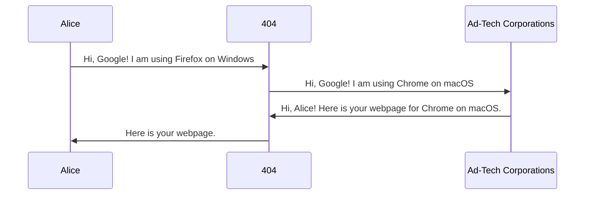

# 404 - Home

## Reclaim Your **Browser Privacy**

*Local by design. Illegibility on purpose.*

!!! info "**{{ latest_github_release_tag }}**"
    404 now has two clear entry points.

    - The **desktop application** is the managed product path. It is subscription-backed and distributed through [404privacy.com](https://404privacy.com/pricing/).
    - The **CLI application** is open source under the AGPLv3 and can be built, run, audited, and modified directly.
    - Download the latest release (**{{ latest_github_release_tag }}**) from [GitHub]({{ latest_github_release_url }}){target="_blank"}.

---

## Choose your path

-   :material-monitor-dashboard:{ .lg .middle } __Desktop App__

    ---

    !!! tip "The fastest way to get started"

    Use the desktop app for:

    - Verified, license-backed downloads and updates
    - Automatic profile management
    - Automated updates
    - Automated WSL2 setup (windows)
    - Automated CA trust and proxy configuration

    [Desktop Documentation](./getStart/appStart.md){ .md-button .md-button--primary } 
    
    [Get 404](https://404privacy.com/pricing/){ .md-button target="_blank" }

-   :material-console:{ .lg .middle } __CLI Application__

    ---

    !!! example "Free and open source"

    CLI documentation covers:

    - STATIC binary
    - Rose binary 
    - Manual profile control
    - eBPF build and attach steps
    - Community support

    [CLI Documentation](./dev/index.md){ .md-button }

    [View the code](https://github.com/un-nf/404){ .md-button target="_blank" }

---

## Core capabilities

```mermaid
sequenceDiagram
    participant F as Alice
    participant 404
    participant A as Ad-Tech Corporations
    F->>404: Hi, Google! I am using Firefox on Windows
    404->>A: Hi, Google! I am using Chrome on macOS
    A->>404: Hi, Alice! Here is your webpage for Chrome on macOS.
    404->>F: Here is your webpage.
```

-   ### Anti-fingerprinting
    404 targets *correlation*: offers coherent profiles across **TLS → headers → JS surfaces → network values**.

-   ### Cross-platform
    The runtime stays local on **Windows, macOS, and Linux**. The desktop application manages that runtime on the host side. The CLI path exposes it directly.

-   ### Open source
    STATIC, the WSL distro, and the eBPF layer remain open source and auditable. The desktop application layer is documented here as a proprietary product wrapper around that open source runtime stack.

---

## The problem

Your browser is telling ad-tech corporations **too much**.

Websites and fingerprinting vendors collect semi-unique signals and combine them into a “personality cloud”:

- Canvas and text rendering quirks  
- WebGL parameters and GPU hints  
- Audio context characteristics  
- Fonts and device enumeration  
- Locale/timezone/screen geometry  
- TLS and header shapes
- Typing speed

404 sits in the middle and **rewrites your fingerprint** before it leaves your machine.

---

## Before you continue

Current legal documents:

- [Privacy Policy](https://404privacy.com/privacy/){target="_blank"}
- [Terms of Service](https://404privacy.com/terms/){target="_blank"}
- [EULA](https://404privacy.com/eula/){target="_blank"}