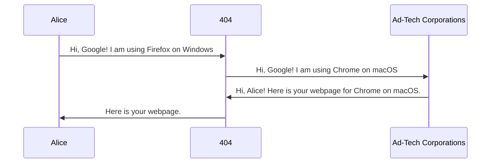

# 404 - Home

## Reclaim Your **Browser Privacy**

*Local by design. Illegibility on purpose.*

!!! info "Current release line"
    404 now has two clear entry points.

    - The **desktop application** is the managed product path. It is proprietary, subscription-backed, and distributed through 404privacy.com.
    - The **CLI application** remains open source under the AGPL and can still be built, run, audited, and modified directly.
    - The latest published open source CLI release is **{{ latest_github_release_tag }}** on [GitHub Releases]({{ latest_github_release_url }}){target="_blank"}.

---

## Choose your path

-   :material-monitor-dashboard:{ .lg .middle } __Desktop App__

    ---

    The fastest way to get started.

    Use the desktop app if you want:

    - managed updates
    - account-backed downloads and licensing
    - Windows WSL2 runtime provisioning without touching `wsl.exe`
    - certificate trust workflow and proxy controls in the UI

    [Open the desktop documentation](./getStart/appStart.md){ .md-button .md-button--primary }
    [Visit 404privacy.com](https://404privacy.com/){ .md-button target="_blank" }

-   :material-console:{ .lg .middle } __CLI Application__

    ---

    The open source operator path.

    Use the CLI documentation if you want:

    - direct access to STATIC
    - local source builds and manual profile control
    - WSL distro packaging and import as infrastructure
    - eBPF build and attach steps on Linux

    [Open the CLI documentation](./dev/index.md){ .md-button }
    [View the runtime repository](https://github.com/un-nf/404){ .md-button target="_blank" }

---

## Core capabilities

```mermaid
sequenceDiagram
    participant F as Alice
    participant 404
    participant A as Ad-Tech Corporations
    F->>404: Hi, Google! I am using Firefox on Windows
    404->>A: Hi, Google! I am using Chrome on macOS
    A->>404: Hi, Alice! Here is your webpage for Chrome on macOS.
    404->>F: Here is your webpage.
```

-   ### Anti-fingerprinting
    404 targets *correlation*: offers coherent profiles across **TLS → headers → JS surfaces**.

-   ### Cross-platform
    The runtime stays local on **Windows, macOS, and Linux**. The desktop application manages that runtime on the host side. The CLI path exposes it directly.

-   ### Open source
    STATIC, the WSL distro build path, and the eBPF layer remain open source and auditable. The desktop application layer is documented here as a proprietary product wrapper around that open source runtime stack.

---

## The leakage problem

Your browser is telling ad-tech corporations **too much**.

Websites and fingerprinting vendors collect semi-unique signals and combine them into a “personality cloud”:

- Canvas and text rendering quirks  
- WebGL parameters and GPU hints  
- Audio context characteristics  
- Fonts and device enumeration  
- Locale/timezone/screen geometry  
- TLS and header shapes
- Typing speed

404 sits in the middle and **rewrites your fingerprint** before it leaves your machine.

That split matters:

- the desktop app is the product-facing shell
- the STATIC runtime and eBPF layer are the open source engine
- the worker-backed account and update surface delivers builds, auth, and release metadata

---

## What 404 changes

-   :material-shield-lock:{ .lg .middle } __TLS Fingerprint__

    ---

    404 controls handshake behavior *as a profile decision*: extensions, ordering, ALPN, key shares, and cipher preferences are defined in the profile.

    !!! note
        TLS impersonation fidelity is adversarial and evolving. The goal is **plausible identity**.

-   :material-home-circle:{ .lg .middle } __Network Telemetry__

    ---

    Rewrites TCP/IP options such as MSS, Window Size/Scale, TTL, and more. These values can be passively collected and used to offer details on your network stack. Tools like nmap and p0f exploit these network telemetry signals to identify your hardware, OS, network environment, and more.

-   :fontawesome-brands-github:{ .lg .middle } __HTTPS Headers__

    ---

    Normalizes and rewrites headers and header ordering to match the chosen persona.

    - Consistent `User-Agent` + client hints  
    - Language/timezone coherence  
    - Optional downgrades/strips to reduce leak paths (e.g., `Alt-Svc` preventing accidental HTTP/3/QUIC identity drift)

-   :material-account-school:{ .lg .middle } __JavaScript Fingerprint Surfaces__

    ---

    Injects a profile-driven spoofing layer (canvas/WebGL/audio/fonts/media devices, etc.) while keeping the identity coherent.

    !!! tip
        Coherence beats randomness. Random noise is how you become a rare, clusterable outlier.

    ---

    ## Before you continue

    If you are evaluating the desktop app as a product, read the current legal documents published at 404privacy.com:

    - [Privacy Policy](https://404privacy.com/privacy/){target="_blank"}
    - [Terms of Service](https://404privacy.com/terms/){target="_blank"}
    - [EULA](https://404privacy.com/eula/){target="_blank"}

    If you are here for the open source path, the CLI application remains documented and linked from this site.
