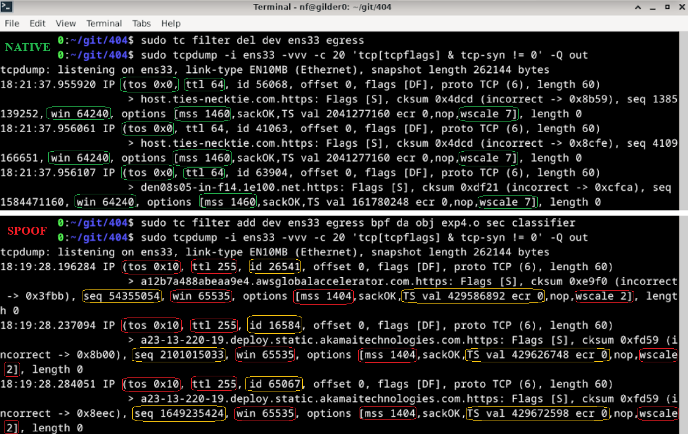

# eBPF

!!! tip "Role"

    The eBPF layer is wired into the Linux runtime path and is part of the open source CLI application and runtime toolchain.

---

## Overview

The eBPF module attaches to Linux Traffic Control (`tc`) egress hooks and rewrites packet-level values that can be used for passive OS and stack fingerprinting via tools like p0f or nmap.



---

## Implementation

The eBPF layer complements STATIC.

- STATIC handles TLS, HTTP, injected runtime shaping, and control-plane behavior.
- The eBPF layer handles lower-level packet mutation on Linux via the Rose kernel.

On Windows, the managed desktop product path reaches this Linux layer through the WSL2 runtime.

On CLI-managed Linux paths, you can build and attach it directly yourself.

!!! note "Why both?"

    Mismatches between network fingerprints and higher-level browser identity can still expose the host as synthetic or misaligned traffic.

---

## Kernel and toolchain requirements

You need a Linux environment with:

- Linux kernel `4.15+` (`5.4+` recommended)
- `clang`
- `llvm`
- `llvm-strip`
- `tc`
- `iproute2`
- `libbpf-dev`
- `linux-headers-$(uname -r)`
- `/usr/include/bpf/bpf_helpers.h`
- `/usr/include/linux/bpf.h`

---

## Configuration

> IP/TCP packet header values are assigned via global variables at the top of `src/ebpf/ttl_editor.c`. They *do not* align with values passed from `profiles.json`, this is a major pitfall of the current version and will be integrated with dynamic `bpfmaps` in a future release.

*Modify hardcoded globals to desired values before compiling.*

!!! note "Native OS Options:"
        
    | OS | TTL | Window Size | Window Scale | ISN | MSS* | Timestamps | TCP Option Order |
    | ----------- | ----------- | ----------- | ----------- | ----------- | ----------- | ----------- | ----------- |
    | Windows | 128 | 64 kb (64240 bytes) | 8 | Randomized | Varies based on connection | Not used | MSS,NOP,WS,NOP,NOP,SACK |
    | MacOS | 64 | 64 kb (65535 bytes) | 6 | Randomized | Varies based on connection | Internal counter | MSS,NOP,WS,NOP,NOP,TS,SACK,EOL |
    | Linux | 64 | 64 kb (65535 bytes - 5840 bytes for 2.4/2.6 kernels) | 7 | Randomized | Varies based on connection | Internal counter - sometimes randomized | MSS,SACK,TS,NOP,WS |

**1. Open `ttl_editor.c` and modify the `#define` values at the top:** *(optional)*

```c
#define FORCE_TTL 255
#define SPOOF_TCP_WINDOW_SIZE 65535
#define SPOOF_TCP_MSS 1460
#define SPOOF_TCP_WINDOW_SCALE 5
// etc.
```

!!! example "Roadmap item"   
    
    The packet policy is still not fully profile-driven in the way the higher-level runtime is.

    Mutation values are still assigned through globals in `src/ebpf/ttl_editor.c` rather than being fully driven by the selected runtime profile.

!!! abstract "Default Implementation Options"

    IPv4:
    
    - TTL (Time To Live) → forced to 255
    - TOS (Type of Service) → set to 0x10
    - IP ID (Identification) → randomized per packet
    - TCP window size → 65535
    - TCP initial sequence number → randomized (again)
    - TCP window scale → 5
    - TCP MSS (Maximum Segment Size) → 1460
    - TCP timestamps → randomized
    
    IPv6:
    
    - Hop limit → forced to 255
    - Flow label → randomized
    - TCP parameters (same as IPv4)

---

## Build path

The Makefile in `src/ebpf` builds:

- `ttl_editor.o`

Typical local invocation:

```bash
make -C src/ebpf clean all
```

You can also build it from inside the directory directly:

```bash
cd src/ebpf
make deps-install
make
```

> This is the same object that is packaged into the WSL distro build path.

---

## Attach path

Attach:

```bash
sudo tc qdisc add dev <interface> clsact
sudo tc filter add dev <interface> egress bpf da obj ttl_editor.o sec classifier
```

Remove:

```bash
sudo tc filter del dev <interface> egress
sudo tc qdisc del dev <interface> clsact
```

---

## Verify and inspect

Verify attachment:

```bash
sudo tc filter show dev <interface> egress
```

Inspect outgoing traffic:

```bash
tcpdump -i <interface> -vvv -Q out
tcpdump -i <interface> -vvv -c 20 -Q out 'tcp[tcpflags] & tcp-syn != 0'
tcpdump -i <interface> -vvv -nn -Q out | grep -E 'ttl|win|mss|wscale'
tcpdump -i <interface> -vvv -XX -Q out
tcpdump -i <interface> -vvv -Q out port 443
```

---

## VM forwarding

If you want to expose a host machine through a Linux VM that is running the packet layer, use a bridged adapter for internet access and a host-only adapter between the host and guest.

On the Linux guest, enable IPv4 and IPv6 forwarding and apply the normal forwarding and NAT rules for the host-only and bridged interfaces.

```bash
sudo sysctl -w net.ipv4.ip_forward=1
echo "net.ipv4.ip_forward=1" | sudo tee -a /etc/sysctl.conf
sudo sysctl -w net.ipv6.conf.all.forwarding=1
echo "net.ipv6.conf.all.forwarding=1" | sudo tee -a /etc/sysctl.conf

sudo iptables -A FORWARD -i <host-only-interface> -j ACCEPT
sudo iptables -A FORWARD -o <host-only-interface> -j ACCEPT
sudo ip6tables -A FORWARD -i <host-only-interface> -j ACCEPT
sudo ip6tables -A FORWARD -o <host-only-interface> -j ACCEPT

sudo iptables -t nat -A POSTROUTING -o <bridged-interface> -j MASQUERADE
sudo ip6tables -t nat -A POSTROUTING -o <bridged-interface> -j MASQUERADE
```

On the host, point the default route at the guest's host-only adapter IP.